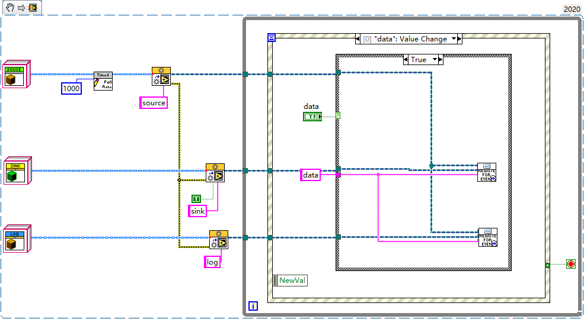
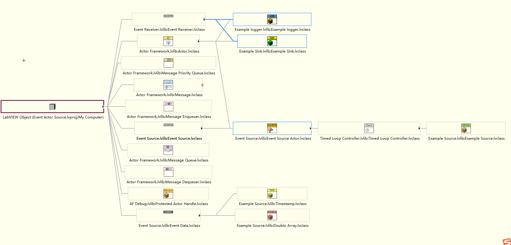

# Event Source Actor By Interface

Actor for LabVIEW Actor Framework implementing publisher subscriber model of communication with zero coupling

**Source LabVIEW Version:** 2020

**Author:** Piotr Kruczkowski

**Fork from:** [GitHub - Primary-Key/Event-Source-Actor](https://github.com/Primary-Key/Event-Source-Actor)

---

Event Source Actor的接口实现，为了便于理解增加了范例，删除了没有使用的Event Receiver Actor类，只保留接口。

范例类图如下：

Example Source：数据产生类，继承Timed Loop Controller实现定时发送数据

Example Sink：订阅Example Source的数据并在界面显示

Example logger：订阅Example Source的数据并记录文件日志

Doublo Array：数据类型，继承自Event Data

Timestamp：数据类型，继承自Event Data

[GitHub - lv-tools/Event-Source-Actor](https://github.com/lv-tools/Event-Source-Actor)
